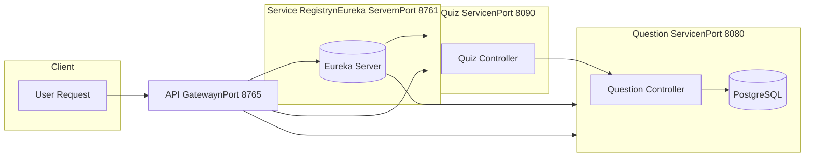

# Microservices Quiz App


A scalable Quiz Application built using Java Spring Boot and Microservices architecture. The system separates question management from quiz creation and uses a Service Registry for discovery.


## Architecture


The project consists of four main modules:


1.  **Service Registry (Eureka Server)**

   * Acts as a discovery server for all microservices.

   * Runs on port `8761`.

2.  **Question Service**

   * Responsible for creating, retrieving, and managing the database of questions.

   * Runs on port `8080` (Default).

3.  **Quiz Service**

   * Manages the creation of specific quizzes.

   * Communicates with the `Question Service` using **Spring Cloud OpenFeign**.

   * Runs on port `8090`.

4.  **API Gateway**

   * **Entry Point:** The single entry point for all client requests.

   * **Routing:** Dynamically routes traffic to services based on the URL path using Eureka Service Discovery.

   * **Port:** `8765`.





## Tech Stack


* **Java 17+**

* **Spring Boot** (Web, Data JPA)

* **Spring Cloud** (Netflix Eureka, OpenFeign, Gateway)

* **PostgreSQL**

* **Lombok**

* **Maven**


## Getting Started


### Prerequisites

* Java JDK

* Maven

* PostgreSQL


### Installation & Running


1.  **Clone the repository**

   ```bash

   git clone https://github.com/modhtom/quiz-app-microservices.git

   ```


2.  **Start the Service Registry**

   * Navigate to `/service-registry`

   * Run: `mvn spring-boot:run`

   * Verify Eureka is running at `http://localhost:8761`


3.  **Start the Question Service**

   * Navigate to `/question-service`

   * Update `application.properties` with your database credentials.

   * Run: `mvn spring-boot:run`


4.  **Start the Quiz Service**

   * Navigate to `/quiz-service`

   * Run: `mvn spring-boot:run`


5.  **Start the API Gateway**

   * Navigate to `/api-gateway`

   * Run: `mvn spring-boot:run`


## API Endpoints (Via Gateway)


Instead of calling services directly, use the Gateway URL: `http://localhost:8765`.


The Gateway uses the service name (both lowercased and uppercased ) to route requests.


### Question Service Endpoints


- GET /question-service/question/allQuestions


 - Retrieves all questions from the database.


- GET /question-service/question/category/{category}


 - Retrieves questions filtered by a specific category.


- POST /question-service/question/add


 - Adds a new question to the database.


### Quiz Service Endpoints


- POST /quiz-service/quiz/create


Creates a new quiz with a specific title and number of questions.


- POST /quiz-service/quiz/get/{id}


Fetches the question details for a specific quiz ID.


- POST /quiz-service/quiz/submit/{id}


Submits user answers and calculates the final score.


## Feign Client Configuration


The Quiz Service communicates with the Question Service via the `QuizInterface`.


It creates a proxy that talks to the `QUESTION-SERVICE` registered in Eureka, ensuring load balancing and loose coupling.

